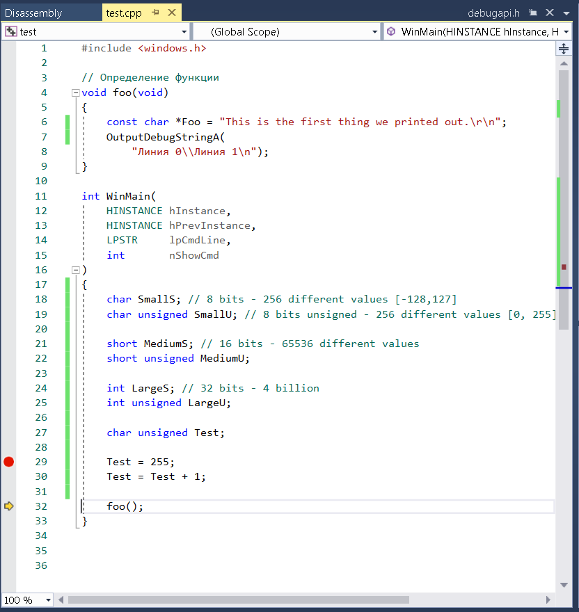
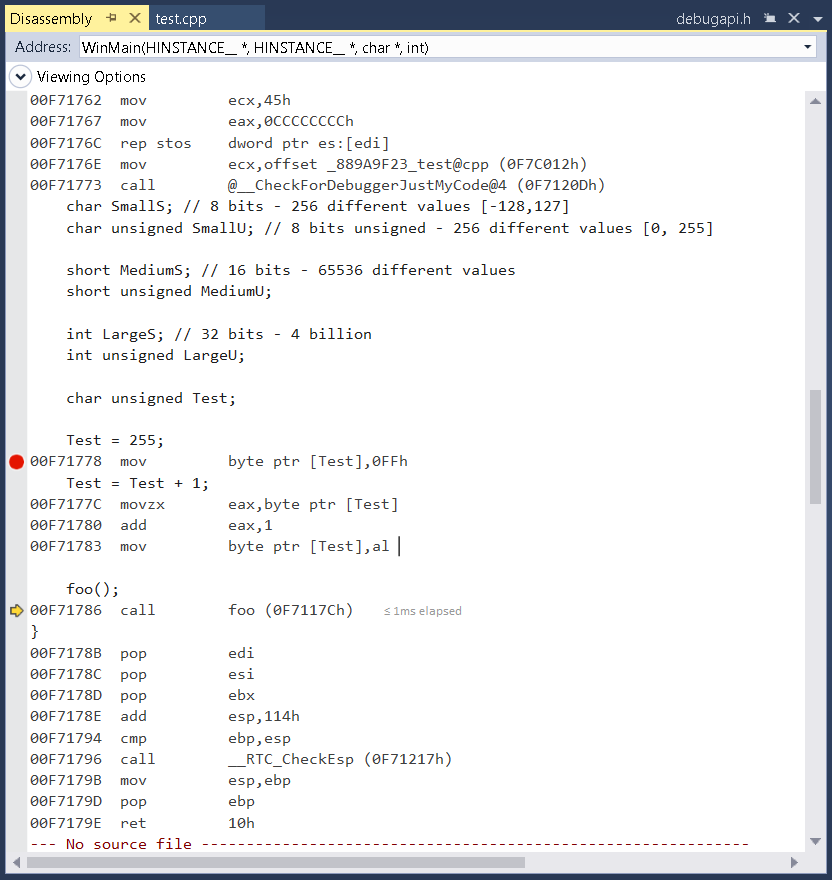
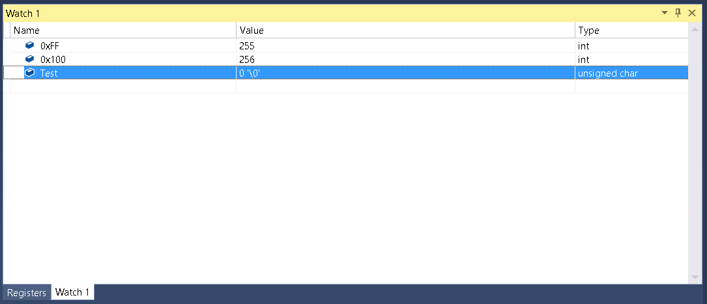
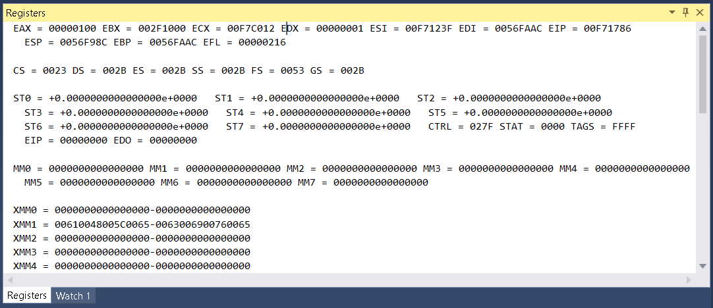

# 0x00_C_introduction
Introducing the basic concepts of the C programming language required to start programming a complete game from scratch

The main code

The disassembly automatically generated code

The watch windows

The registers being used to move data back and forth

